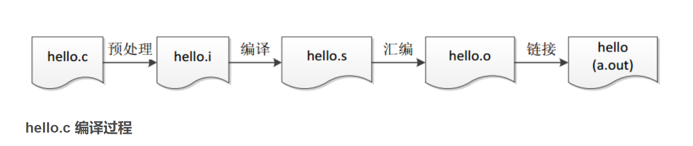

# 第一章 开始

## 熟悉编译器

**g++**：


- 编译：`g++ --std=c++11 ch01.cpp -o main`
- 运行：`./prog1`
- 查看运行状态：`echo $?`
- 编译多个文件:`g++ ch2.cpp Sales_item.cc -o main`
- 输入 `g++ --help`，查看编译器选项
- 输入 `g++ -v --help`可以看到更完整的指令。

**获得程序状态**:

- windows: ``echo %ERRORLEVEL%``
- UNIX: ``echo $?``

## IO

- ```#include <iostream>```
- ```std::cout << "hello"```
- ```std::cin >> v1```

记住`>>`和`<<`返回的结果都是左操作数，也就是输入流和输出流本身。

**endl**：这是一个被称为**操纵符**（manipulator）的特殊值，效果是结束当前行，并将设备关联的缓冲区（buffer）中的内容刷到设备中。

UNIX和Mac下键盘输入文件结束符：`ctrl+d`，Windows下：`ctrl+z`
- 读取数量不定的输入数据，通过 Ctrl + z + Enter 终止输入
- ```cpp
    #include<iostream>
    using namespace std;

    int main()
    {
        int s=0,i=0;
        while(cin>>i){
            s+=i;
        }
        cout<<s;
        return 0;
    }
    ```

**头文件**：类的类型一般存储在头文件中，标准库的头文件使用`<>`，非标准库的头文件使用`""`。申明写在`.h`文件，定义实现写在`.cpp`文件。

**避免多次包含同一头文件**：

```cpp
#ifndef SALESITEM_H
#define SALESITEM_H
// Definition of Sales_itemclass and related functions goes here
#endif
```

**成员函数（类方法）**：使用`.`调用。

**命名空间（namespace）**：使用作用域运算符`::`调用。

## 注释

- 单行注释： `//`
- 多行注释： `/**/`。编译器将`/*`和`*/`之间的内容都作为注释内容忽略。注意不能嵌套。
```cpp
#define SALESITEM_H
/*
 * 多行注释格式
 * 每一行加一个*
 */
```

## 使用文件重定向

``./main <infile >outfile``
- 在win的cmd下：`main.exe <add_item >add`（从add_item中读取数据，打印到add）
