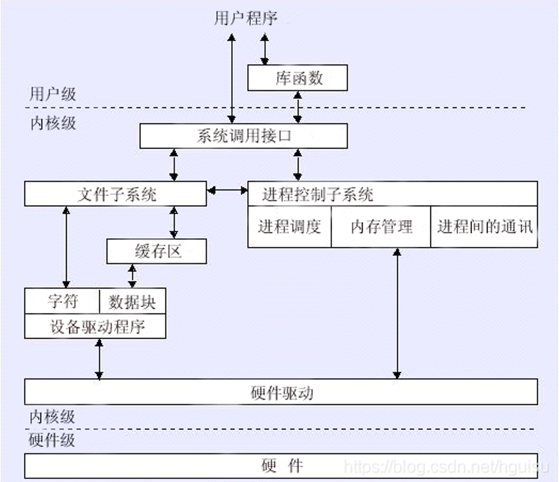

## 7.26-8.1
其中有一天在回家路上，
## 调车
- 相机 / 下位机 使能
  - configs的sensor中更改配置
- yolo无法检测到图形（奇怪的错误）
  - 每次 ./PHOENIX 前要先删除文件夹里的模型缓冲 .cache
- 切换 armor / rune mode
  - predictor.cpp/detector.cpp/shooter.cpp
  - `// auto&& mode = recv->sensor->control[Sensor::ControlIdentify::Main].mode;` 
  - `auto mode = Mode::Rune;`
- 切换 big / small rune mode
  - predictor中rune.cpp
  - `// SetState(MotionState::Big);  //符的状态的缺省值`
  - `// SetState(MotionState::Static); //符叶静止`
  - `SetState(MotionState::Small);`
- 欧拉角
  - 三个欧拉角一样就是电控没传数据
  - `float euler[3] = {};  //(0,1,2) = (yaw,roll,pitch)`
  - Z Y X =（偏航，俯仰，翻滚）
  - Yaw：往左变大
  - Roll 不用管
  - Pitch：往下变大
- 电控
  - 电控改代码时视觉程序不需要重启
  - 电控打断点调试视觉程序会断
  - 核对坐标px、py是否一致
  - 核对传入的速度与实际速度（有枪管才能测出实际速度）
- 符
  - 蓝色点是相机中心，黄色点是发射点
  - 尽量使黄蓝点在同一个垂直线上，水平方向由于补偿量的存在不一致
  - 绿包蓝点是预测点
  - 打符的时候先定住点亮一片符叶调试
- 麦轮
  - 遥控器
    - 打开时左上右下初始化
    - 左下，右调整底盘模式
    - 左中，右调整云台模式，右中
    - 左下，发射模式，拨动滑轮进行发射
- 调参面板
  - px、py装甲板补偿量
  - rpx、rpy打符补偿量
  - chasedelay延时调整

## 机器人通识
- 总体架构：控制器、执行器、传感器
  - 微控制器（MCU）-- 集成CPU + 外围电路
    - STM32
  - 微处理器（MPU）-- 单片CPU
    - Intel NUC、Jetson系列
  - 裁判系统 
    - 从上到下分别为图传模块、测速模块、工业摄像头
    - 图传模块（第一视角画面传送操作手）
    - 测速模块（测算弹速、检测发射机构热量）
    - 装甲板（应变压力传感器检测大小弹丸）
    - 灯条（显示机器人血量）
    - 电源管理等
  - 执行器
    - 电机、舵机
  - 传感器
    - 工业相机、雷达
    - 惯性测量单元（IMU）
      - 陀螺仪（检测姿态角） + 加速度计
  - 电池（电源）
  - 机器人整体机械架构（步兵）
    - 云台 + 底盘
- 官方步兵模型：

## 最小二乘法
- 一种求解线性回归的方法
- 计算 估计值与实际值的差的平方和 最小
```python
import matplotlib.pyplot as plt
from sklearn.linear_model import LinearRegression

features = [2,5,8,8,13,15,17,19,21,24]
target = [12,31,45,52,79,85,115,119,135,145]

# 绘制散点图
plt.scatter(features, target)
plt.xlabel('Features')
plt.ylabel('Target')
plt.title('Scatter Plot')
plt.show()

# 简单线性回归
regression = LinearRegression()  
model = regression.fit(features,target)   

# 预测
print(model.predict(10))
```