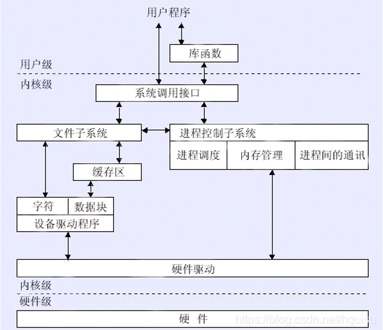

## 远程连接linux主机
- 远程连接使用ssh协议，linux主机是ssh服务器
  - `sudo apt-get install openssh-server`安装openssh软件的服务端
  - win上的远程连接工具一般自带客户端 ssh-client
- 
  - W：当前主机有哪些用户登录（vscode为远程通信，无法用w查看）
  - tty：查看终端（:0为本地图形终端）
## linux文件存储系统
- 一切对象皆文件
- linux的7种文件类型（使用`ls -l`查看）
  - “-”：普通文件（纯文本文件）
  - “d”：目录文件 - directory（不会直接把纯粹的文本展现出来）
  - “l”：软链接文件 - link（相当于windows下的链接文件）
    - `ln -s test test.s` test.s相当于test的软链接文件（操作test.s相当于操作test）
  - “b”：块设备文件 - block（存储数据的设备-硬盘，如sda）
  - “c”：字符设备文件 - character（有鼠标、键盘、显示器、打字机等，这些设备是以字符的方式进行数据传输的）
  - “p”：管道文件类型 - pipe
  - “s”：套接字文件类型 - socket
- linux文件依靠文件系统管理（常见的有ext2，ext3，ext4等）
- 基本概念：
   -  磁盘：用来存储数据的硬盘
   -  分区：（软件概念）
      -  linux的目录只是分区的逻辑映射
      -  硬件设备的文件名：
         - IDE硬盘 - /dev/hd[a-d]
           - 第一个IDE设备被称为hda，第二个被称为hdb。hda作为硬盘也可以分区，可以分为hda1，hda2等
         - SCSI/SATA/USB硬盘 - /dev/sd[a-p] 
         - 光驱 - /dev/cdrom
         - 软盘 - /dev/fd[0-1]
         - 鼠标 - /dev/mouse
         - 伪设备 - /dev/loop[n]
           - 虚拟机中有很多
      - 用`df`命令来查看分区
      - 用`fdisk`命令操作linux分区
   - 块：文件系统读写，存放数据的最小单元（软件概念）
     - 可以自己设置大小（一般使用默认大小），一般只能设置1kbyte，2kbyte，4kbyte（4k byte居多）
     - 每个block只能存放一个文件的数据
   - 扇区：磁盘控制器（读取磁盘的硬件设备）
     - 每次对磁盘进行读写的最小单位，一般为512byte
     - 硬件概念，大小由硬件厂商设定
     - 每次一扇区一扇区得读太慢于是有了块的概念，一块一块读
   - inode：将文件的属性、权限等和文件实际数据分开存储（可看作一个文件索引）
     - 用来记录文件的属性，一个文件占用一个inode，同时记录该文件数据所存储的block
     - linux有而windows没有
     - 属性包括但不限于：
       - 文件的权限：读，写，执行
       - 文件所有者，所属组
       - ctime，atime，mtime
       - 文件数据存储的位置
     - 文件的名称本身就是目录文件的数据，不存储在inode中，也正是文件inode的索引
- linux系统读取文件的过程：
  - 操作系统通过文件名称找到对应的inode
  - 通过inode找到文件真正存储的block
  - 磁盘控制器开始读取block对应的扇区
  - 磁盘读取到的数据达到一个block，就传输到内存中
  - （ 这样以操作系统系统的角度看，block是文件系统读写文件的最小单元 ）
