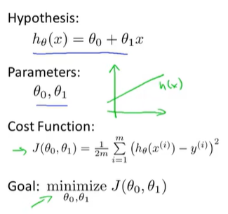
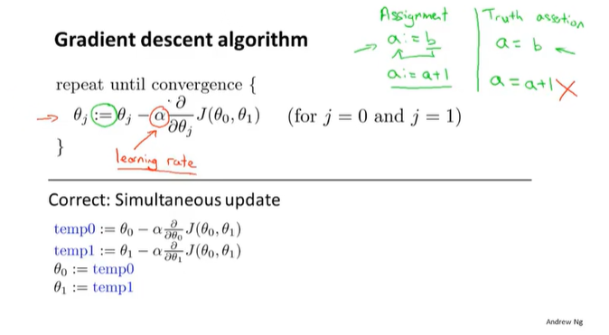
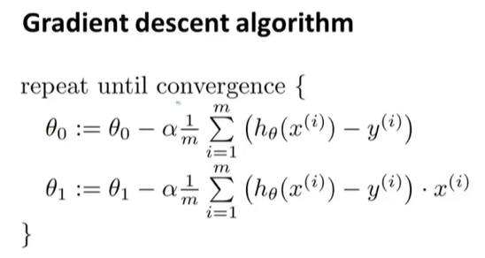

- 监督学习（Supervised Learning）：a datasat with labels
  - 回归问题（Regression）：连续
  - 分类问题（Classification）：离散
- 无监督学习（Unsupervised Learning）：a dataset with no labels
  - 聚类算法（Clustering Algorithms）
  - 降维算法（Dimensionality Reduction Algorithm）
- 符号
  -  m：样本数量
  -  x：输入变量/特征
  -  y：输出变量/预测的目标变量
  -  （x，y）：一个训练样本
  -  h：假设函数
- 一元线性回归（单变量线性回归）
  - 代价函数（平方误差函数/损失函数）：二分之一（方差和的平均值） （/m是为了使值不那么大，多个2是为了方便求导）
    -  
  - 梯度下降讲法：sovle more general problems
    - 学习率：梯度下降时迈出多大步子  
    - 两个参数要同步更新
    - 
    - 越靠近局部最优解下降越慢
  - 线性回归中的梯度下降--Batch Gradient Descent
    - 