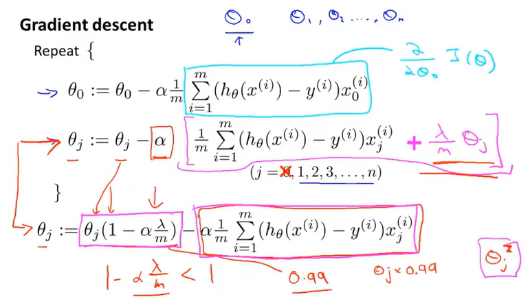

## 机器学习分类

- 监督学习（Supervised Learning）：a datasat with labels
  - 回归问题（Regression）：连续
  - 分类问题（Classification）：离散
- 无监督学习（Unsupervised Learning）：a dataset with no labels
  - 聚类算法（Clustering Algorithms）
  - 降维算法（Dimensionality Reduction Algorithm）
- 符号
  -  m：样本数量
  -  x：输入变量/特征
  -  y：输出变量/预测的目标变量
  -  （x，y）：一个训练样本
  -  h：假设函数

## 一元线性回归（单变量线性回归）
  - 代价函数（平方误差函数/损失函数）：二分之一（方差和的平均值） （/m是为了使值不那么大，多个2是为了方便求导）
    -  
  - 梯度下降法：sovle more general problems
    - 学习率：梯度下降时迈出多大步子  
    - 两个参数要同步更新
    - 
    - 越靠近局部最优解下降越慢
  - 线性回归中的梯度下降--Batch Gradient Descent
    - 
  - 矩阵
    - 只有方阵才有逆矩阵，且行列式不为0
## 多元线性回归
  - 
  - 
  - 特征放缩（因为特征值的取值范围差别较大 ）
    - 归一化来使梯度下降更快
    - 标准化（均值归一化）：使平均值等于0
      - 
      - 
  - 学习率 一次迭代是指走一步下山还是一次下山，而且这样子得到的不是局部最优解吗，起点在哪里
- 正规方程（偏导数=0的矩阵写法）
  - 直接求出最优解：（最小二乘法？）
  - 用正规方程法则不需要进行特征放缩
- 梯度下降法和正规矩阵法
  -  
## logistic回归算法（sigmoid function）
  - 一种分类算法（与线性回归算法同级）
  - 算法输出介于0和1之间
  - 
  - 决策边界 将平面分为两部分的线 概率为0.5
    - 用训练集来拟合参数theta（直接把theta带入括号后等于零即为决策边界）（线性规划）
    - 
  - logistic回归算法如果使用上方代价函数，其图像是一个非凸函数，有许多局部最优值
  - 代价函数
  - 
  - 
  - 
  - 
  - 使用梯度下降法时看起来和线性回归算法一样，实际上h(x)变了
    - 
  - 比梯度下降法更加复杂的算法：共轭梯度法、BFGS、L-BFGS算法（不用手动设置学习率，有智能内循环，比梯度下降法更快收敛）
- 多类别分类问题（一对多）--- 有多个分类器，最后选出h(x)可信度最高的那个
## 过度拟合（过多变量，过少训练数据）
  - 代价函数小，但是高方差，泛化不好
  - 泛化：一个假设模型应用到新样本的能力 
  - 线性回归： 
  - 逻辑回归：
  - 解决方法
    - 减少特征变量数量
      - 手动选择需要保留的特征
      - 模型选择算法（自动选择需要保留的特征）
    - 正则化 - 减少量级或者参数theta j的大小
      - 正则化项就是惩罚项
      - 加上后面的项，要求代价函数最小值的话theta会尽可能小，就像直接把变量去掉了一样，而且又不会丢失特征（约定俗成从theta1开始加，其实从theta0开始加也没什么区别）
        - 
        - 入为正则化参数，控制两个不同目标之间的取舍（入太大会导致欠拟合）
          - 目标一：更好地拟合数据
          - 目标二：保持参数尽量小/41
    - 线性回归的正则化
      - 梯度下降法：
      - 正规方程法：
      - 正则化也可以解决正规方程中一些X的转置乘X的不可逆问题
    - 逻辑回归中的正则化：/54
