## 神经网络
- 解决非线性分类问题
- 与线性回归和逻辑回归同级
- 激活函数 -- 非线性函数
- 模型参数 -- 权重
- x0为偏执单元，等于1
- 单个神经元：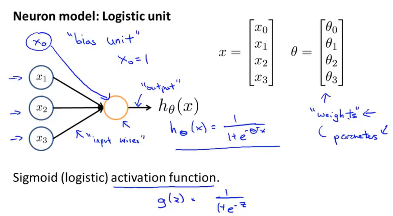
- 神经网络（一组神经元）：
- 参数：a-激活项，theta-权重矩阵
- 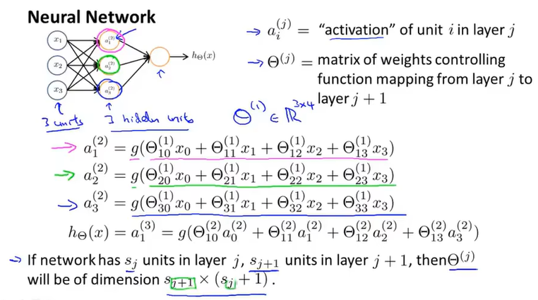
- 二元分类：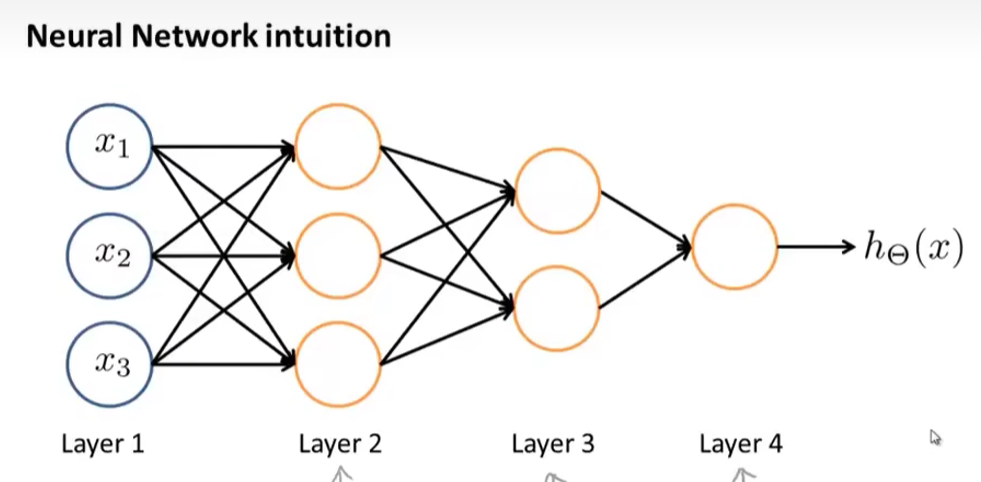
- 多分类：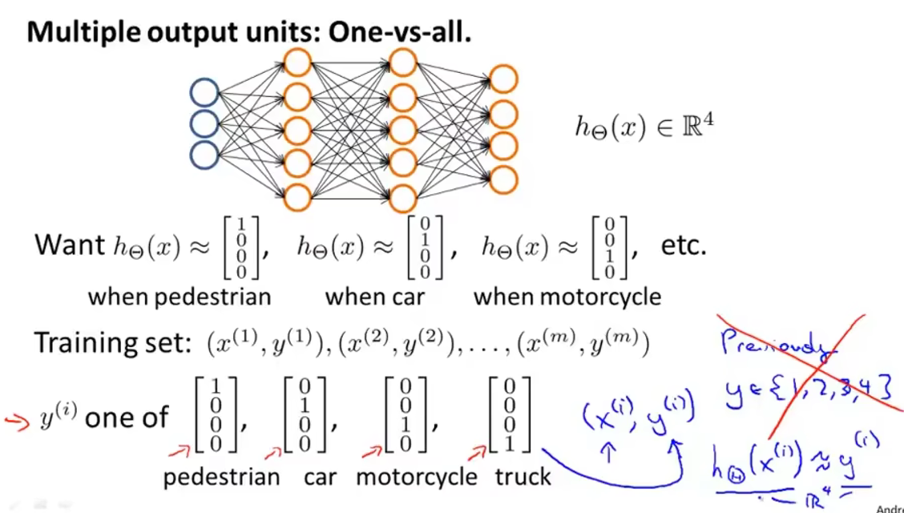
- 代价函数：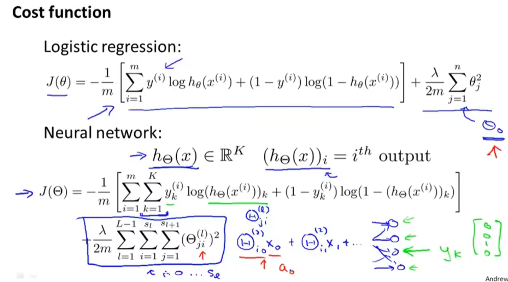
- 反向传播算法：g是sigmoid激活函数，第四层误差是实际值和计算值的差，第二三层误差是对损失函数求偏导后的化简：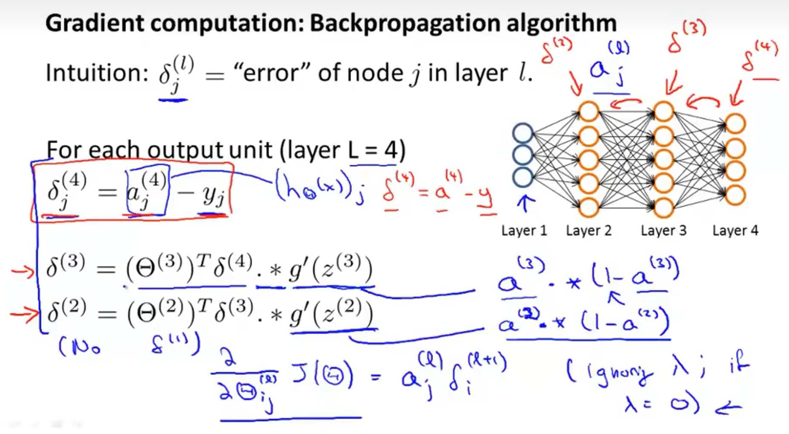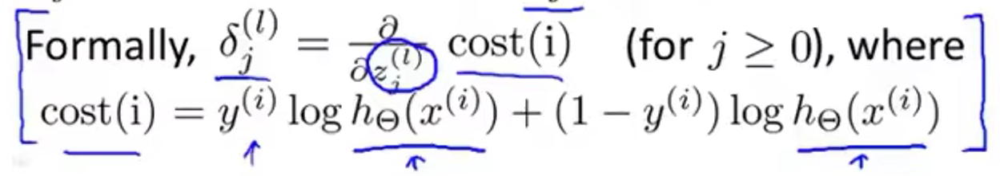
  - 反向传播可能会出现一些意想不到的bug，因此进行梯度检验：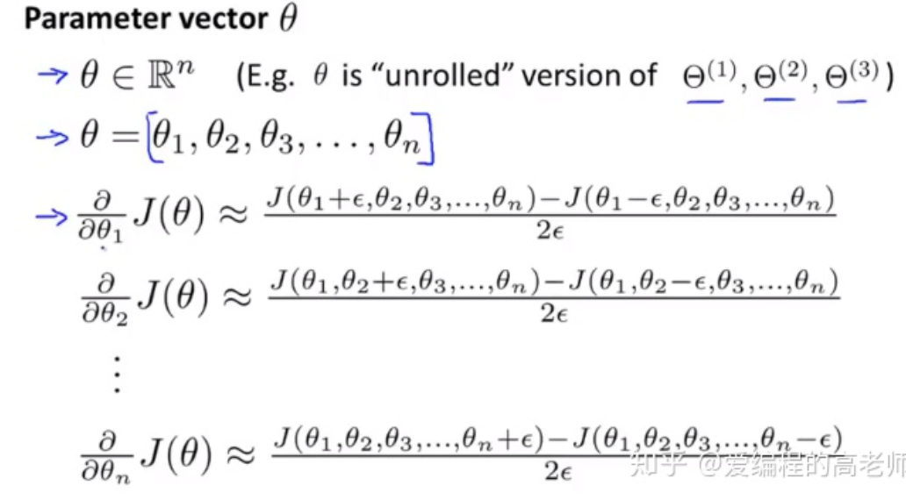
  - 将梯度检验计算出来的梯度gradApprox和反向传播计算出来的梯度DVec进行比较，通过调整DVec的计算方法保证DVec和gradApprox比较接近
  - 确定反向梯度传播的正确性后，关掉梯度检验（计算量太大），用满足了刚刚梯度检验的后向传播代码进行神经网络的学习
- 权重矩阵进行随机初始化（若是全部初始化为0则会使梯度下降迭代失去意义，所有的值都相等 -- 对称权重问题）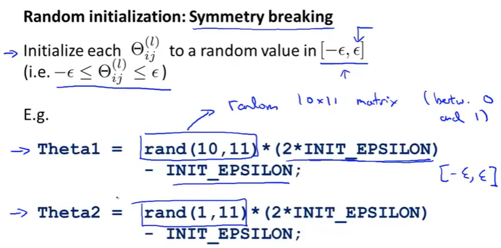即生成服从-epsilon到epsilon均匀分布的随机值
- 步骤：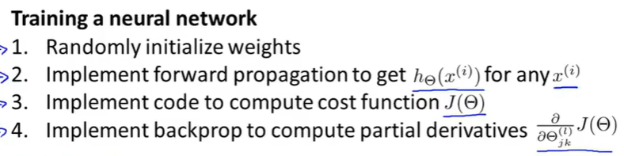
  - 1. 构建神经网络，随机初始化权重（通常初始化为很小的值，接近于0）
  - 2. 向前传播，计算出y
  - 3. 计算代价函数
  - 4. 反向传播，计算代价函数偏导数
  - 5. 梯度检验，与反向传播数值进行比较
  - 6. 关掉梯度检测，进行梯度下降（或其他高级优化算法）
- 调参方法：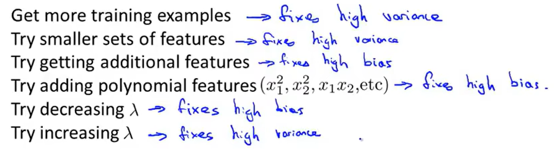
- 机器学习诊断法 -- 用于评价算法，并算法进行有效改进
  - 模型评估：把数据分为训练集（Train）、交叉验证集（Cross_Validation）、测试集（Test）
    - 一般来说：6：2：2
    - 用训练集训练，验证集选择模型，测试机评估泛化能力
  - 判断偏差与方差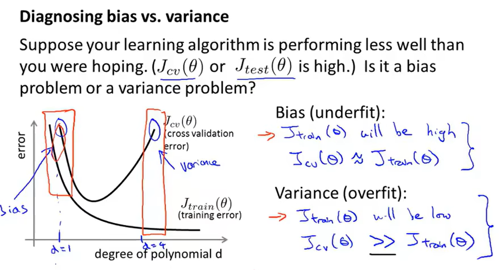正则化入：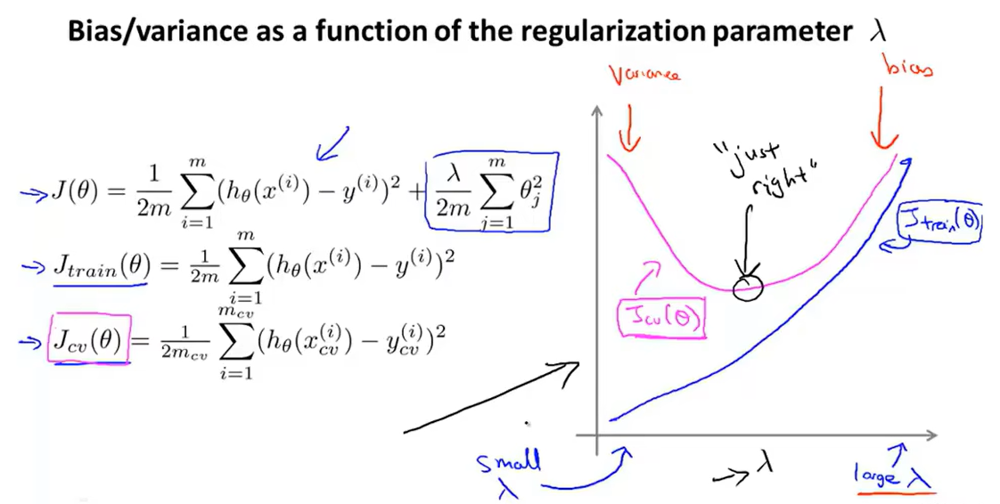学习曲线：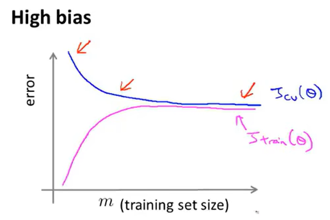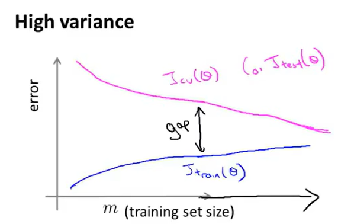
    - 高偏差问题(High Bias)：欠拟合，使用的多项式次数过小
      - 训练集误差和验证集误差都高，正则化入大，增大训练集没用
    - 高方差问题(High Variance)：过拟合，使用的多项式次数过大
      - 训练集误差小，验证集误差高，正则化入小，增大训练集验证误差和训练误差变小
  - 查准率/召回率（越高模型越好）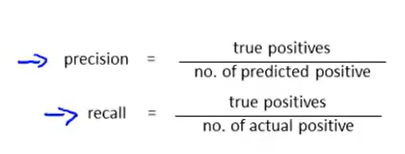
    - precision：预测对的阳性/预测阳性数量      
    - recall：预测对的阳性/实际阳性数量
    - 改变预测值值域从而调整查准率和召回率，两者大致反比，所以要权衡：
    - 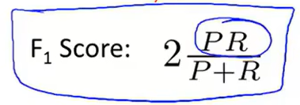
