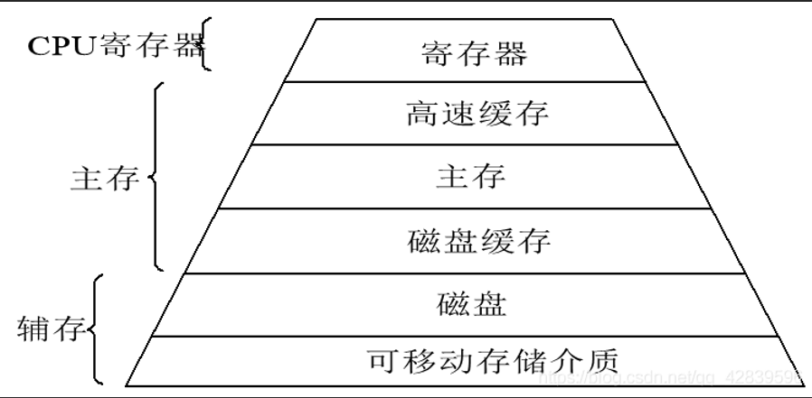

## 现代计算机的存储结构
计算机的存储设备可以按照存储容量的从大到小，速度从慢到快，单位存储价格从低到高分为：网络（可以认为存储数量无限）、磁盘、磁盘缓存、物理内存（主存）、高速缓存、寄存器

其中寄存器在cpu内部，其它的都在cpu外部。

1. 寄存器：Cpu只能直接使用寄存器中的数据，所以任何数据都必须要传递到寄存器中才可以使用。
   - 寄存器体积非常小，对于32位系统来说，有32bit，对于64位系统来说，有64bit。
   - 从数量上来说，寄存器也很少，也就十几个。
2. 高速缓存：后来引入的概念，以提高主存和寄存器的交换速度。
3. 主存：一般有两种主存的概念（如图），这里指物理内存
   - 程序的主要过程都在内存上体现。
   - 物理内存就是我们使用的内存条，但是用户在开发程序时是以进程为单位的，如果直接使用物理内存会非常困难，所以发明了虚拟内存的概念。
   - 在32位的系统中，每个进程都会有一个4g的虚拟内存，我们直接操作4g的虚拟内存，然后cpu的MMU模块会将虚拟内存映射到物理内存上。
   - 内存上的内容在系统关闭时会清空，只有写到磁盘上才可以长久存储
4. 磁盘缓存：提高磁盘与主存的交互速度。
5. 磁盘：磁盘是计算机长期存储的主要设备，比如文件写在磁盘上。
6. 网络：需要数据时从网络获取
