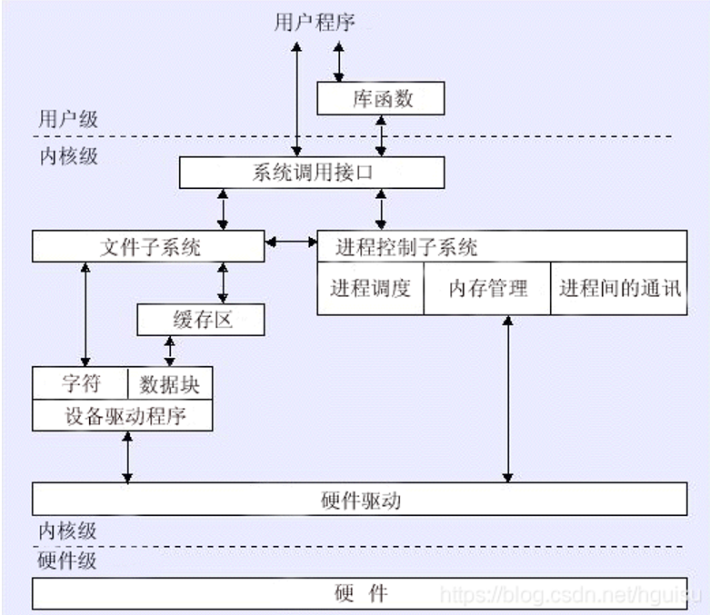

## linux系统整体结构的划分

- linux系统可以简单的划分为 **用户区** 和 **内核区**
- linux系统为何分区
  - **进程** 是操作系统的执行单元，用户的一切操作都是以 **进程** 为单元的。
    - 一个进程也可以被划分为用户区，内核区
    - 从数据、硬件、操作系统的安全性考虑，分区是必须的
    - 进程在用户区在执行时，不能访问内核区的东西（操作系统的核心在内核区）
    - 进程在内核区时，可以任意访问用户区与内核区。
    - 进程的分区就是以操作系统的分区为前提的
- linux系统如何分区
  - linux是面向进程设计的操作系统，一切都要靠进程来运行。需关注进程分区如何实现
  - 进程依靠指针寻址。
    - 32位系统中一个进程就是4g byte（2的32次方byte），一个32位的指针（指针的位数等于系统的位数，32位系统就是32位的指针）刚好可以寻址。
    - 因为指针只有32位或64位。所以一个进程只能有“2的32次方或64次方大小”，否则无法寻址了
    - 堆内存的本质是：在需要时申请的物理内存，申请到指针无法寻址为止，也就是达到一个进程的上限。
  - 由于指针的值可以修改，从软件的角度无法将用户区，内核区进行划分
  - 操作系统就通过CPU来实现分区
    - CPU有0，1，2，3级4种运行级别，linux和windows都只使用了0级或3级。当进程在用户区时，CPU在3的运行级别下运行，此时指针只能访问用户区。进程切换到内核区时，CPU的运行级别就切换到0级了，指针可以访问用户区和内核区