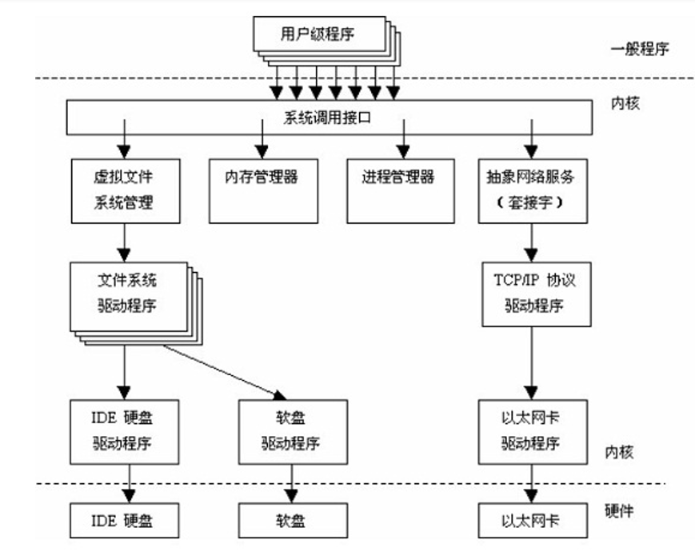

## linux内核区

- linux系统内核区可以分为三部分
  - 下层
    - 驱动程序：直接将硬件抽象为一个个文件，方便上层操作
  - 中层 -- 操作系统真正的核心
    - 文件系统：对屏幕输出也是在对文件进行操作
    - 内存管理系统：我们经常需要对堆内存进行申请，释放操作
    - 进程管理系统：linux系统以进程为最小执行单元，而进程需要资源
    - 网络服务模块
  - 上层
    - 系统调用接口：用户区通过调用系统调用接口来间接操作内核区
- 进程内核区的对象为何一定要手动释放
  - 栈内存：函数执行完毕，栈内存自动回收，无需自己考虑。
  - 堆内存：动态申请的内存不会自动释放。栈内存是堆内存寻址的唯一方式，可以给堆内存添加一个引用计数，如果引用计数为0，那么就销毁堆内存（智能指针的工作原理）
  - 内核区：没有办法可以自行判断释放时机，任何语言都只能自己手动释放