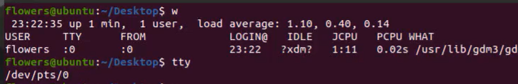

## 远程连接linux主机
- 远程连接使用ssh协议，linux主机是ssh服务器
  - `sudo apt-get install openssh-server`安装openssh软件的服务端
  - win上的远程连接工具一般自带客户端 ssh-client
- 
  - W：当前主机有哪些用户登录（vscode为远程通信，无法用w查看）
  - tty：查看终端（:0为本地图形终端）