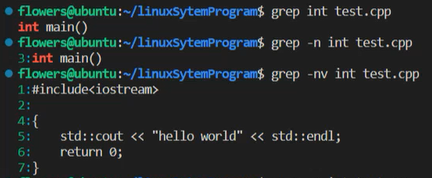
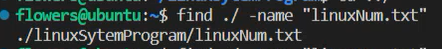

## man命令与一些基础概念，操作
- man命令 
  - `man ls`
  - 使用`h`键帮助操作
  - `/`在man之后帮助查找（如`/-L`，就会标出-L）
  - man命令调用的手册分为8个部分（只有前三个常用，可用`man man`查看）
    - 用户的命令（`man stat`）
    - 系统调用（`man 2 stat`）
    - 库函数
    - 设备和特殊文件
    - 文件格式和约定
    - 游戏
    - 宏命令和约定
    - 系统管理命令，需要管理员权限才能执行
- ls命令
  - `ls -l` # 以长格式显示当前目录中的文件和目录
  - `ls -a` # 显示当前目录中的所有文件和目录，包括隐藏文件
- grep命令
  - 从一个文件中选择出目标行 
- 文件查找命令
  - find（常用）
    - 用文件名查找文件位置：
  - locate
    - 比find命令快，搜索的是/var/lib/locatedb数据库
  - whereis
    - 可以搜索linux系统全部的可执行文件
  - which
    - 可以查看linux系统的命令是否存在，并返回命令的位置

