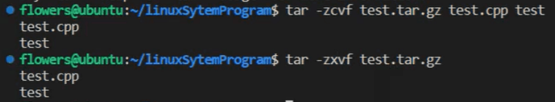

## 压缩，解压缩命令
- 基本命令(.tar.gz是最常用的压缩格式)
  - `tar -zcvf 压缩文件名.tar.gz 被压缩的文件名`(生成压缩文件)
  - `tar -zxvf 压缩文件名.tar.gz`(解开压缩文件)
  - 
- 工作原理
  - 过程（压缩+打包）
    - 给每个文件生成一个.gz的压缩文件（可以有多种方式）
    - 用tar命令将这些.gz的压缩文件打包在一个压缩包中（只有tar方式）
  - 参数
    - -z：表示tar先使用gzip生成压缩文件
      - 若使用bzip2来先压缩单个文件就改为-j参数
      - 使用其他压缩方式只需替换'-z'为相应参数
    - -c：表示压缩
    - -x：表示解压
    - -v：表示压缩或解压缩时显示操作的文件