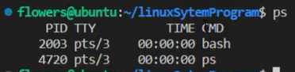

## 进程管理命令
- ps命令
  - ps命令不加参数只能显示当前用户在本终端上运行的进程，所以我们一般都要对ps命令加上参数
  - `ps`分别为：进程号，终端，时间，运行的命令或程序 
  - `ps -ef`：显示当前主机所有的进程。
  - `ps -aux`：显示当前主机所有的进程(少数情况显示的属性和上一命令略有区别)
  - `ps -o`：只显示想要的属性（如`ps -o command`，`ps -eo uid,pid,command`
- top命令
  - 用于监视整个linux系统进程
