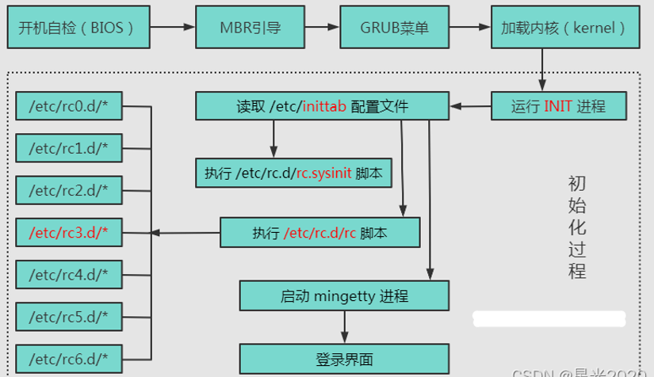
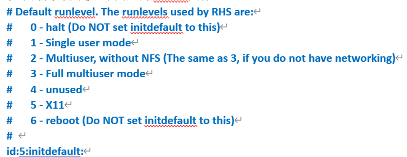

## 早期linux系统的开机方式

- 开机过程：
  - 从开机自检（BIOS）到加载内核阶段（是嵌入式核心，但对C++后端不重要）
  - 启动init进程：
    - (1)作为linux系统的第一个进程，PID为1，又叫超级进程、根进程
    - (2)负责产生其它所有的用户进程，所有的进程都被挂在这个进程下
      - 如果这个进程退出了，那么所有进程都会被kill
      - 如果一个子进程的父进程退出了，那么这个子进程会被挂到这个根进程下面
    - (3)linux以进程为最小执行单元，做任何事情都要依靠进程
  -  init进程在启动时会读取/etc/inittab，接着根据该配置文件的启动层级和执行项来启动对应的程序
     - 典型inittab文件：
     - 真正有用的：id:5:initdefault，表示init进程要启动的进程将会完成操作系统5级的功能
     - linux系统的7种运行级别：
       - 0级：关机
       - 1级：单用户模式
       - 2级：无网络的多用户模式
       - 3级：多用户模式（无图形界面）
       - 4级：未使用（为用户自己设计预留的级别）
       - 5级：多用户模式（有图像界面）
       - 6级：重启
  - 执行系统初始化脚本（/etc/rc.d/rc.sysinit）：对linux系统一些必备的东西进行初始化，如时钟、键盘、磁盘、文件系统等。
    - 长且复杂，都是对系统级的操作
  - 执行启动层级对应的脚本（/etc/rc*.d）:linux系统不同的运行级别有不同的进程，这些进程依靠这些脚本来启动。
    - 在上面的例子中，/etc/inittab文件中记录的运行级别为5，由init进程执行/etc/rc5.d进程，进行5运行级别必要的操作。
  - 对于不同的运行级别是不同的，对于3级，5级来说，就是启动对应的终端。5级为图形终端，3级为命令行终端。然后执行rc.local文件
    - 早期需要在系统启动时自动启动的用户级进程，就添加到rc.local文件中
    - 后面有了service系统，无需手动更改配置文件

