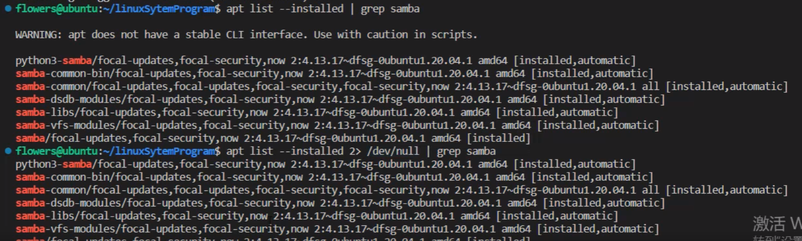
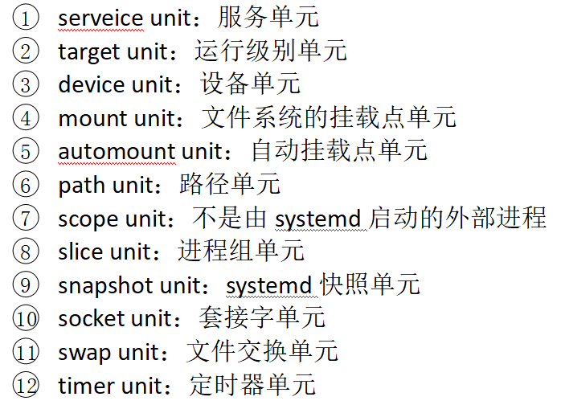

## systemd系统（新的启动方式）
- 名称介绍：
  - 根据linux习惯，字母d是守护（deamon）的缩写。systemd在名称上就是要守护整个linux系统的含义
- systemd系统和init系统的区别：
  - 第一个启动的进程不是/etc/init进程，而是/lib/systemd/systemd
  - 默认启动的系统级进程通过系统目录进行配置（代替/etc/inittab的配置方式）
    - systemd依次从这些目录中读取配置文件，优先级从高到低
    - **配置目录**
      - **/etc/systemd/system**
      - **/run/systemd/system**
      - **/lib/systemd/system**
- 以安装samba服务为例
  - `apt list`查看已下载的安装包
    - `apt list --installed | grep samba`更加精确地查看对应安装包
  - 
    - 将warning重定向输出到文件中，2是错误输出的文件描述符，只输出错误的
  - 在安装好samba服务后，系统会在/lib/systemd/system目录中添加一个默认的配置文件。
  - 若在/etc/systemd/system目录下添加自己编写的配置文件，可将/lib/systemd/system目录下的配置文件覆盖掉
  - /run/systemd/system是系统用来配置的，无需理会
- 配置文件
  - 一个服务的启动，完全其配置文件决定
  - 配置文件可以分为三部分
    - unit块：启动顺序与依赖关系
    - service块：启动行为
    - install块：定义如何安装这个配置文件，即如何做到开机自启
  - systemd系统配置服务非常规范，可对这些配置文件按照固定的格式优化（比如让多个服务同时启动，大幅提高服务启动效率）
  - init系统，配置文件中仅仅是让脚本启动的命令，脚本格式完全由开发人员确定。导致整个系统难以优化，各种服务只能线性的依次启动，效率很低。
- systemd系统
  - 优缺点
    - 功能强大，使用简单
    - 体系庞大，十分复杂
  - systemd将整个linux系统的资源划分为12个单元（12个unit）
    - 
    - 其中只需要了解掌握serveice unit：服务单元、timer unit：定时器单元、timer unit：定时器单元
  - systemctl是systemd的主要命令，可以用于管理服务单元
    - ①systemctl enable httpd.service：使某任务开机自启
    - ②systemctl disable httpd.service：使某服务不开机自
    - ③systemctl status httpd.service：服务详细信息 
    - ④systemctl list-units --type=service：显示所有已经启动的服务
    - ⑤systemctl start httpd.service：启动某服务
    - ⑥systemctl stop httpd.service：停止某服务
    - ⑦systemctl restart httpd.service：重启某服务