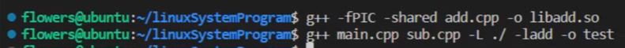

## 静态库，动态库
- `ldd executableFilename`查看可执行文件所需要的动态链接
- 静态库和动态库介绍
  - 动态库：
    - 程序执行时才会连接（程序缺乏动态库，仍然可编译，只在执行时会出现找不到定义的错误）
    - 每个进程都有动态库链接区，存储程序在编译时链接的动态库
  - 静态库：
    - 程序编译时就会被整合进最终可执行文件的库（缺失则无法编译）
- 静态库和动态库对比
  - 静态库得到的程序体积要比动态库大很多
    - ①	静态库是在编译期被整合进可执行程序的，每有一个地方调用静态库，就要将静态库整合进去
    - ②	动态库只有在可执行文件执行时才会被加载（动态库只加载了一次）
  - 使用动态库的程序在启动时要比静态库慢一些
    - 动态库在执行时才会加载，而静态库在编译时就加载了
  - 总结：一般使用动态库（如C++运行库），若有些程序被加载的次数很少，且比较追求启动时的效率，也可以使用静态库
- 静态库动态库的制作与使用
  - 动态库 
    - 制作
      - ① `g++  -fPIC  -shared  fileName1.cpp  -o libFileName1.so`
      - PIC(Position Independent Code)表示要生成位置无关的代码，这是动态库需要的特性
      - -shared告诉g++生成动态库而不是可执行文件
    - 使用
      - ② `g++  fileName2.cpp  fileName3.cpp  -L ./  -l libFileName1 -o executableFilename`
      - -L后为动态库路径
      - -l后为动态库名称
      - -o后为最终可执行文件名称
    - 执行该可执行文件后，报错找不到动态库，解决方法：
      - 进程在加载动态库时，会按照优先级从高到低的顺序在以下路径依次寻找
      - 1.在生成可执行文件时指定动态库的存放路径
        - `g++  fileName2.cpp  fileName3.cpp  -L ./  -l libFileName1 -Wl,-rpath=./ -o executableFilename` 
        - 一般不推荐使用，容易导致动态库的存放混乱
      - 2.修改环境变量
        - `export LD_LIBRARY_PATH = $LD_LIBRARY_PATH:libPath` 
        - 这种方法最简单，但只可以作为临时的设置方式
        - 也可修改配置文件使其长期生效，但此方式不推荐
      - 3.在/lib、/usr/lib目录中查找动态库
        - 可以直接将动态库复制到这两个目录中
        - 但/lib目录下存放的动态库大都是系统级别的（如C++标准库），自己的动态库一般不会直接拷贝到/lib目录中
      - 4.在/etc/ld.so.config文件中添加动态库路径
        - (1) sudo vim /etc/ld.so.conf
        - (2) 在文件最后行添加路径
        - (3) 保存并退出文件后再 sudo ldconfig（使生效）
        - 在做项目时，可以在/usr/local下创建一个目录，然后将这个目录添加到/etc/ld.so.config文件中
      - 短期内设置路径推荐2，长期设置路径推荐4
    - 静态库（使用频率低于动态库）
      - 制作
        - ①	`g++ -c *.cpp` 将.cpp 文件生成对应的.o文件
        - ②	`ar rcs libxxx.a *.o` 使用ar工具将多个.o文件生成一个静态库
      - 使用
        - `g++ main.cpp -L./ -lxxx -o test`
        - 无需考虑链接路径的问题

