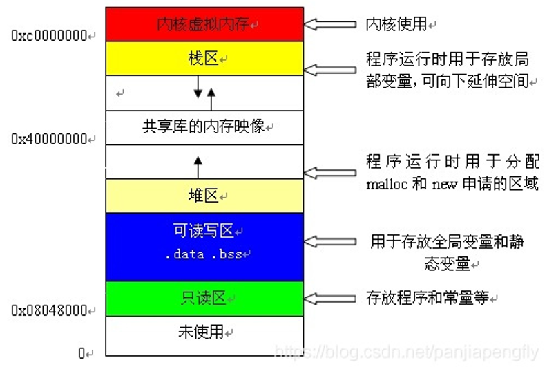

## 程序的执行过程
程序被执行后就被称为一个进程，一个进程可以被划分为很多区域 
1. **代码区与常量区**：进程按照代码区的代码执行，真正的常量也存储在这里(比如“abc”字符串、“1”、“88”等数字)，const只是让编译器将变量视为常量，和真正的常量有本质的区别
2. **栈区**：函数的执行所需的空间（函数执行完毕后，其对应的栈内存全部销毁）
3. **堆区**：进程用来灵活分配内存的地方，只有手动释放才会销毁内存
4. **静态变量区**：存储静态变量与全局变量的区域
   - (1) 静态变量：局部作用范围、生命周期却很长的变量
   - (2) 全局变量：在C++中不推荐使用，会破坏封装性

总结：堆区和栈区，是程序运行的主要地方
- 不能只在栈上运行程序，因为当函数运行结束时，栈是要销毁的，其上分配的内存全部失效。
- 不能只在堆上运行程序，因为堆的唯一寻址方式就是指针，如果没有栈，根本无法使用堆
- 栈区远远小于堆区，一般不超过8M，所以主要的内容都在堆区上
- 堆区很大，虚拟内存剩下的都是堆区