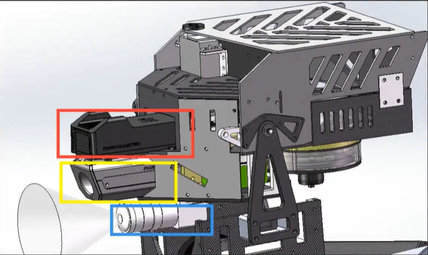
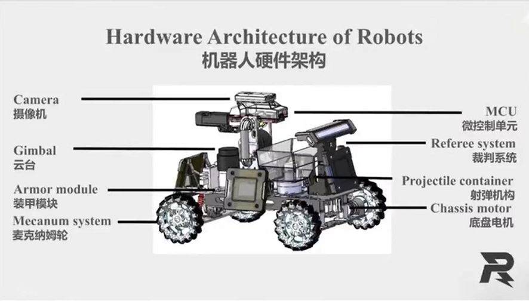

## 机器人通识
- 总体架构：控制器、执行器、传感器
  - 微控制器（MCU）-- 集成CPU + 外围电路
    - STM32
  - 微处理器（MPU）-- 单片CPU
    - Intel NUC、Jetson系列
  - 裁判系统 
    - 从上到下分别为图传模块、测速模块、工业摄像头
    - 图传模块（第一视角画面传送操作手）
    - 测速模块（测算弹速、检测发射机构热量）
    - 装甲板（应变压力传感器检测大小弹丸）
    - 灯条（显示机器人血量）
    - 电源管理等
  - 执行器
    - 电机、舵机
  - 传感器
    - 工业相机、雷达
    - 惯性测量单元（IMU）
      - 陀螺仪（检测姿态角） + 加速度计
  - 电池（电源）
  - 机器人整体机械架构（步兵）
    - 云台 + 底盘
- 官方步兵模型：